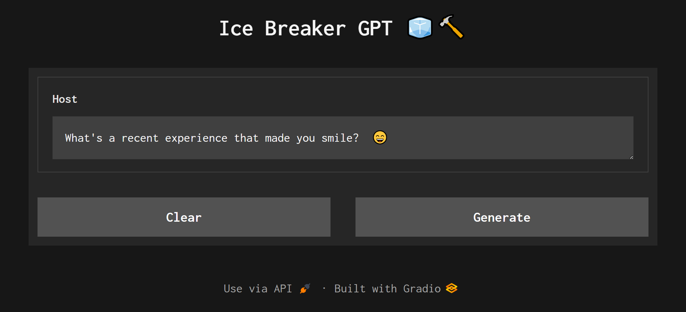

# Ice Breaker GPT 🧊🔨

An application that generates a random interesting question to be used as an "ice breaker" in a conversation.



## Usage (Run locally)

Go to the [Groq Cloud](https://console.groq.com/) to get your free API key and export it as an environment variable.

```bash
export GROQ_API_KEY='<api_key>'
```

Clone the github repository and navigate to the root folder.

```bash
git clone <repo-link>
cd ice-breaker-gpt
```

Create a virtual environement and install the necessary libraries from `requirements.txt` file.

```bash
python -m venv env
env\Scripts\activate
pip install -r requirements.txt
```

Run the FastAPI endpoint using `uvicorn`.

```bash
uvicorn app:app --reload
```

Append the running URL with `/gradio` to run the application. For instance for me the app runs locally at `https://127.0.0.1:8000/gradio`

> Feel free to tweak the prompt in [`instructions.txt`](./instructions.txt) file to personalize your responses.

## Acknowledgements

I drew inspiration for this project and got the example questions (included in the prompt) from [OmegleMe](https://omegleapp.me/). Furthermore, I used [this](https://lib.scu.edu.cn/genai/static/wenjian/The%20Art%20of%20Asking%20ChatGPT%20for%20High-Quality%20Answers--Ibrahim_John.pdf) book to craft my system prompt for better responses.

## Contribution

Feel free to open a PR or an issue in case of any drawbacks.
